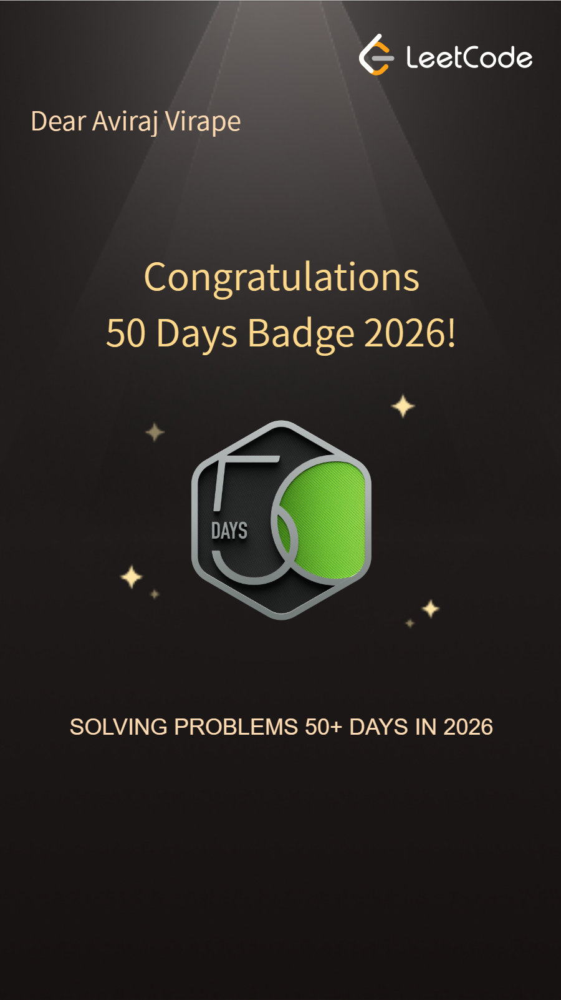
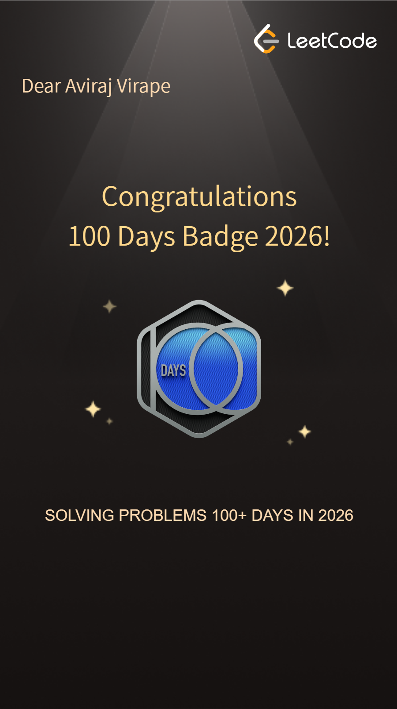

# Hi, I'm Aviraj

**Pune, India** | **AI/ML Engineer** | **B.E. AI & Data Science '27** | **Ex. Founder, MahaGuru AI**

> Building AI systems that reason, mentor, and adapt.

---

## Featured: MahaGuru AI

**An open-source AI mentor and personalised classroom for college students.** Live, tested and deployed.

| | |
|---|---|
| **StudentGPT** | A reflective mentor that asks before it advises. English and Hinglish safety screening on every message, a structured understanding record, and a clarity summary at the end. |
| **Classroom** | Turns a goal into a diagnostic, a personalised roadmap, generated lessons with an AI teacher, quizzes, graded projects and adaptive mastery tracking. |
| **Engineering** | FastAPI and React (TypeScript) monorepo, PostgreSQL, streamed replies over SSE, a provider-agnostic LLM layer (Gemini by default), one Docker image |
| **Quality** | pytest on SQLite and PostgreSQL, Playwright end-to-end tests on desktop and mobile, CI on every push, and a 24-scenario evaluation suite including crisis cases |

[Research behind it](https://mahaguru-ai.onrender.com/research) · [Architecture](https://github.com/aviraj1805/MahaGuru-V1/blob/main/docs/architecture.md) · [Evaluation method](https://github.com/aviraj1805/MahaGuru-V1/blob/main/docs/evaluation.md) · [Screenshots](https://github.com/aviraj1805/MahaGuru-V1#screenshots)

---

## Other Projects

- **[intelligent-aerial-monitoring](https://github.com/aviraj1805/intelligent-aerial-monitoring)** — intelligent-aerial-monitoring (IAMARS)
- **[Customer-Churn-Prediction](https://github.com/aviraj1805/Customer-Churn-Prediction)** — Predict the probability that a telecom customer will churn based on their usage patterns.
- **[Phonepay](https://github.com/aviraj1805/PhonePe)** — A data analysis and visualization project built on the PhonePe Pulse dataset.
- **[Tesla Stock Prediction](https://github.com/aviraj1805/Tesla-Stock-Price-Prediction)** — Deep learning pipeline: SimpleRNN → LSTM → tuned LSTM with multi-horizon forecasts
- **[Real Estate Advisor](https://github.com/aviraj1805/Real-Estate-Investment-Advisor-XGBoost-)** — XGBoost model predicting property profitability and future value
- **[Yes Bank Stock Price Prediction](https://github.com/aviraj1805/YesBank_Internship)** — Machine learning project to predict Yes Bank closing stock prices using historical OHLC data.
- **[iTunes Music Store](https://github.com/aviraj1805/iTunes-Data-Analysis)** — SQL-based analysis of the Apple iTunes database to derive insights on customer behavior.

---

## What I'm Doing

- **Building MahaGuru AI** — A reflective AI mentor and an adaptive AI classroom for students, open source and live
- **Evaluating LLM behaviour** — Scenario-based evaluation suites, safety screening and structured, validated LLM outputs
- **Shipping ML pipelines end-to-end** — From EDA and model selection to deployment and monitoring
- **Researching human-centered AI** — Presented at INMEC-2026, Keystone School of Engineering, Pune (reflective mentorship with LLMs)

---

## Experience

**Founder — MahaGuru AI** *(Jan 2024 – Nov 2025; rebuilt as open source in 2026)*
Founded an AI student-guidance startup, selected into **COEP's I2I Startup Program**. After the company shut down, rebuilt the product from scratch as an open-source platform that is now [live](https://mahaguru-ai.onrender.com): StudentGPT (reflective mentor) and Classroom (adaptive learning), built with FastAPI, React and PostgreSQL, with CI and end-to-end tests.

**Data Science Intern — Innovexis** *(Feb 2026 – May 2026)*
Built an ETL pipeline loading PhonePe Pulse JSON data (2018–2024) into a 9-table MySQL database, and a multi-page Streamlit + Plotly dashboard answering 10 business questions via SQL.

---

## GitHub Activity

  

  
52 Weeks Contribution Activity

---

### LeetCode Profile

**Statistics**

**Badges Earned**

  
  
  

---

### LeetCode Heatmap

52 Weeks Submission Heatmap | Last Updated — 01/05/2026

---

## Publication

Presented **"AI-Powered Reflective Mentorship"** at INMEC-2026 (1st International Conference, Keystone School of Engineering, Pune, Mar 2026)

---

## Education

**B.E. — Artificial Intelligence & Data Science**, 2023 – 2027, CGPA 9.2

**HSC Science**, Yashodhara Junior College, Solapur *(2021 – 2022)* — 78%

---

## Connect

  
  
  
  

---

### Recognition

- Presented at **INMEC-2026, Keystone School of Engineering, Pune** — AI-Powered Reflective Mentorship
- Selected into **COEP's I2I Startup Program** — institutional backing for Mahaguru AI
- **Certified AI/ML Engineer** - Apna College Prime 2.0 Batch

### Philosophy

> Build systems that are useful, measurable, and honest. Ship working prototypes. Iterate from real feedback. Let the model do the heavy lifting — but understand every layer beneath it.

Random Facts

- Fine-tuned my first LLM on a manually curated student dataset
- Founded an AI startup before finishing undergrad
- Competed on LeetCode to sharpen DSA fundamentals
- Believe in building small, shipping fast, and improving in production
- Based in Pune — powered by chai and curiosity

